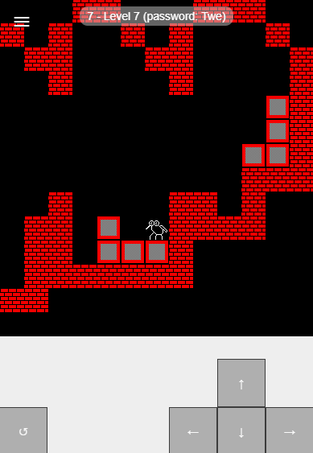

## A fun little experiment with JavaScript to recreate Block Dude from the TI-83

I had already made it in Python, wanted a fun project to play with TypeScript, service workers
and other Web technologies.

### Links

- [Live version](https://apps.cdroulers.com/block-fly/)
- [Source code](https://github.com/cdroulers/block-fly)
