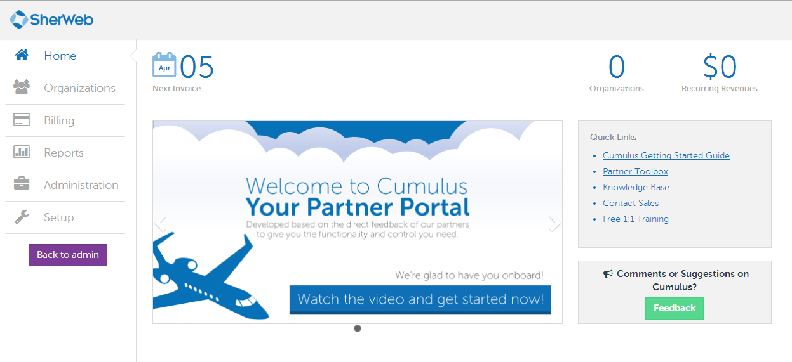
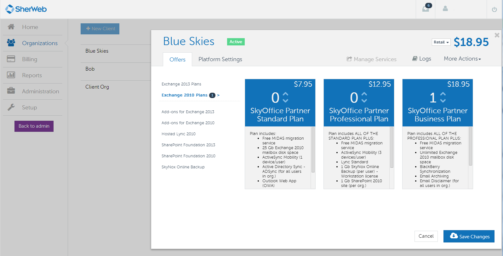

## A new and improved Control Panel for SherWeb partners

This project was an enormous undertaking. We wanted to redo pretty much every part of our multiple portals while also merging them into a one-stop-shop for all of our clients. We aimed for our partner clientele first.

The focus was performance and ease-of-use. We used a bunch of new technologies for the first time. The technical stack is as follows (in no particular order):

- [C# 5](http://msdn.microsoft.com/en-ca/vstudio/hh341490.aspx)
- [Microsoft SQL Server 2012](https://www.microsoft.com/en-us/server-cloud/products/sql-server/)
- [NHibernate 3](http://nhforge.org/), [Fluent NHibernate](http://www.fluentnhibernate.org/)
- [Fluent Migrator](https://github.com/schambers/fluentmigrator)
- [StructureMap](http://docs.structuremap.net/)
- [RabbitMQ](http://www.rabbitmq.com/)
- [WCF](http://msdn.microsoft.com/en-us/library/dd456779.aspx)
- [ASP.NET API](http://www.asp.net/web-api)
- [TypeScript](http://www.typescriptlang.org/)
- [Durandal 2.0](http://durandaljs.com/)
- [Knockout 3](http://knockoutjs.com/)
- [Splunk](http://www.splunk.com/)
- [Windows Server 2012](http://www.microsoft.com/en-ca/server-cloud/products/windows-server-2012-r2/default.aspx)
- [PowerShell](http://technet.microsoft.com/en-ca/scriptcenter/powershell.aspx)
- [Quartz.net](http://www.quartz-scheduler.net/)
- [NuGet](http://nuget.org/)
- [ThinkTecture Identity Server](https://github.com/thinktecture/Thinktecture.IdentityServer.v2)
- [TopShelf](http://topshelf-project.com/)
- [Transifex](https://www.transifex.com/)
- [SignalR](http://signalr.net/)
- [Common Logging](http://netcommon.sourceforge.net/) & [log4net](https://logging.apache.org/log4net/)
- [NUnit](http://www.nunit.org/)
- [Selenium](http://docs.seleniumhq.org/)

### Main goal

We decided that a rewrite was appropriate for the core functionalities since what we had was fairly old and unmaintained. Many projected features warranted major changes in the legacy code base and were estimated to take more time and more risk than rewriting from scratch. We were also fortunate enough to have many of the original developers still with us that helped build the software and the tests required to ensure we weren't missing anything.

We knew which part we wanted to improve and how since there had been talks and meetings and some basic architecture planning done in the two years preceding the development. In each following section, I'll explain each technology, why we chose it and how we used it.

### Main architecture

We had many problems with responsiveness because of speed issues in our enormous back-ends for Exchange, SharePoint and many other services. One of the first concerns we had was how we could ensure users would get quick feedback without losing the robustness of our systems. We decided to use Message Queuing for this particular issue.

The basic architecture now has a core solution that has all the business logic, data storage, web services and daemons (Windows Services). There is then a Portal solution which calls the core web service as well as uses Message Queuing to get real-time updates to the clients' browsers via SignalR.

The message queuing was heavily used for the provisioning of services. When saving a client's quotas of services, messages would be sent via RabbitMQ and daemons would listen on our many infrastructures (three different Windows Domains for two different versions of Exchange in two data centers). This architecture can scale to many more data centers, new services (and support for existing services that weren't scoped in our first version). More details in the [RabbitMQ section](#rabbitmq) below.

A few of our technology decisions were driven by our current expertise. A mention will be made for each where that was the case.

### C# 5.0

C# is the de-facto language at SherWeb. It's a great language and everyone knows it well. We use .NET in general because it allows for easy integration with a lot of other Microsoft products such as Exchange, SharePoint, PowerShell, Lync and Windows Server.

### Microsoft SQL Server 2012

SQL Server has been our database server since the beginning of the development department at SherWeb. Changing for this project would be innefficient and a waste. We've also rarely had performance problems that weren't fixable by changing our queries to better ones.

### NHibernate 3, Fluent NHibernate

In earlier projects, ORMs were not fully evaluated. We defaulted to Microsoft's flavour of the week many times (LINQ to SQL, Entity Framework 4.3). For Cumulus, we decided to evaluate a bit more. Entity Framework 5 had recently come out and looked decent. We started with it and regretted it a few months down the road. But since we had wrapped our code properly via Domain Driven Design, it only took a couple of days to migrate the mappings to NHibernate and the database migrations to [Fluent Migrator](#fluent-migrator).

Fluent NHibernate allows us to map POCOs to our database with code which is great for refactoring and debugging code contrary to regular NHibernate mappings which are made through XML. Makes it really easy to see at a glance what are the mappings, User Types and anything else really.

### Fluent Migrator

Fluent Migrator is a database migration framework. It's extremely easy to use when beginning and offers a lot of power for managing database versions and changes between versions. We've successfully used it to develop features in parallel that touched the same areas of a database. We've also easily used it to deploy in production for new versions without the need for human intervention.

### StructureMap

StructureMap is an IoC container. It is used to abstract many dependencies in our code, which we can then easily mock for testing. It allows for flexibility in configuration as well as permits us to use useful design patterns such as the decorator (which we used for our authorization layer and planned to use for caching later).

### RabbitMQ

RabbitMQ is a message broker system. It is central to the well-being of the Cumulus project. At first, we thought we would mostly use it to render some slow tasks asynchronous. But as we learned its power, it became a bigger part of the architecture. We did benchmark it against Microsoft's Service Bus 1.0 (which had just come out as on-premise at the time) and it came out ahead by a lot.

We now use it for many things such as automated recurring billing, credit card processing, error management and provisioning. Any process that doesn't absolutely require a synchronous action is put in a message. It allows for a few things:

- Load balancing
- High availability
- Fault tolerance

With message queuing, our processes are now much simpler. Each step of a process can be launched, processed, retried or cancelled easily. It is also an easy way to set up different entry points to a single process. For example, our scheduler ([Quartz.NET](#quartznet)) never really does much processing itself. Its job is simply to send messages in the broker for processing by other, dedicated services. Therefore, the scheduler is simple, clean and efficient while the other daemons handle the load.

#### Load balancing

Each message published is sent to any queue that has a binding to it. So each daemon creates its own queue. But multiple instances of the same daemon can run and listen on the queue, and each message is only read once. Therefore, we can easily scale any service by installing it on more machines. As load goes up, instances can go up as well.

#### High availability

Since we can have multiple instances of a daemon, it doesn't matter if one goes down, since another should be up. With more instances, the risk of having them all stop at the same time goes down.

#### Fault Tolerance

Even if all the instances of a daemon go down, messages are stored in the queue forever. Therefore, whenever the first daemon comes back online, processing starts again. The RabbitMQ cluster is also fault tolerant and highly available.

### WCF

WCF was used as a layer between the core solution and the different front-ends. It was chosen because it's a clean way to define service contracts and it's easy to share definitions through compiled DLLs (which can include bootstrapping code with StructureMap and a few other goodies). We distribute them internally with our [NuGet server](#nuget). This means we can have different versions running at the same time, referenced by multiple projects without problems (as long as our contracts are backwards compatible). For example, both our main portal and our sign up portal used the same NuGet package to call our core web service.

### ASP.NET API

Our main portal was built with client side technologies. We obviously needed something to serve data for comsuption. We opted for ASP.NET API since it is quite similar to ASP.NET MVC and we already had a lot of experience with it. We used [HAL representations](http://stateless.co/hal_specification.html) for our REST API. HAL and REST together make it very easy to navigate the API without an actual site and it made our TypeScript code easier to read and debug. No URLs were hard-coded anywhere so we could easily change routing of the API if necessary.

### TypeScript

When we decided to go with a client-side application, we knew we didn't want to use JavaScript directly. It had always been problematic for our teams because very little web expertise was available in our team. Dynamically typed languages are a whole paradigm shift and it introduces a new weak point in our code. We looked at options such as CoffeeScript and Dart, but TypeScript had just come out and it looked very nice. We liked the fact that is was a superset of JavaScript and it was basically an implementation of [ECMA6 Script](https://en.wikipedia.org/wiki/TypeScript#ECMAScript_6_support), which meant good forward compatibility. It also made it very easy to integrate with existing JavaScript libraries.

We started using TypeScript in its infancy (0.8 if I recall correctly) and we were using 0.9.5 as of March 14 2014.

### Durandal 2.0

Durandal is an SPA (Single Page Application) framework. We discovered it will looking at options for developing our portal. It does routing, view models, view rendering and many other things. It was easy and quick to set up, offers a lot of built-in functionality and is easily extendable. The creator is very active on his support forum and Stack Overflow. It was a little weird to use with TypeScript at first, but with new versions of both technologies, things got much easier.

### Knockout 3

Knockout is a very good MVVM framework. Durandal uses it for view rendering and it is heavily used in the .NET community for web development. With easy declarative binding, automatic UI refreshes and templating, it was a great choice. It's also extremely extendable. Which means we had cleaner UI code and reusable bindings.

### Splunk

When we started the project, one of our needs that came from experience in other software was centralized logging. We had many applications deployed over many domains and data centers and absolutely no way of knowing where it came from. We had explored [GrayLog2](http://graylog2.org/) at the time (which fired lasers into space, but that's not happening anymore!). When we got around to implementing it, we discovered our Operations team were already using Splunk. With no desire to multiply tools, we started using Splunk.

So far, it's been a great tool. We currently index log4net files in two different data centers and three different Windows domains. All these are stored on a central server which we can access on the web and search quite efficiently. Basic indexes finds fields such as "Level=INFO" and "Logger=Some.Namespace.Class" which means we can easily filter out logs we don't want. It also understood UTC timestamps out of the box! There are many more functionalities that we haven't explored yet, but the basic installation was a great start.

### Windows Server 2012

All our application hosting is done in Windows Server 2012 and IIS. There was no real exploration since everyone had expertise in it (both development and operations team).

### PowerShell

PowerShell was used for data management inside of our solution. Both for [FluentMigrator](https://www.nuget.org/packages/FluentMigrator.PowerShell/) and [Transifex](https://www.nuget.org/packages/Transifex.PowerShell/). These two packages add Cmdlets in the Package Manager Console inside of Visual Studio. It made it easy to import and export translations to our Transifex server. It also made it easy to run migrations on our multiple databases.

We used Remote PowerShell extensively for automatic deployment. Our TFS server would build packages (Web Deployment packages, zip files for daemons, zip files for database migrations, etc.) and we would then connect to the production server, download the packages via HTTPS and run some command for web deploy or fluent migrator. We also had a few PowerShell modules deployed to production servers that technical support staff could use for manual tasks when needed. Remote PowerShell was much easier to use than giving RDP access and having multiple steps to executing scripts. PowerShell offers easy auto-completion as well as integrated documentation.

### Quartz.NET

Quartz is a scheduler daemon that we use to trigger events a few times a day. Its configuration is simple XML that refers to plain C# code. It can also be configured to be resilient and highly-available with SQL Server as a data store.

### NuGet

NuGet is an obvious choice when developing in .NET. The community is huge and most libraries are available on the official [nuget.org](http://nuget.org/) website. It's also fairly simple to create an internal NuGet server that can be added to developers' Visual Studio configuration. We deployed any utility library we had to this server. We also used it to deploy our WCF contracts as well as Message Queuing contract classes. Multiple solutions could refer to different versions and there were no compilation problems.

### ThinkTecture Identity Server

ThinkTecture Identity Server is an open-source project that implements a lot of the basics for single sign-on in web application. It supports a lot of protocols and can be extended quickly to support more. We decentralized our authentication from our portal since we are planning on never having more than one username for any new application. We even implemented a hybrid authentication mechanism so we could re-use our local Active Directory's users as well as create users in a database for our clients.

### TopShelf

TopShelf is an enormous time-saver. Developing Windows Services with Visual Studio is annoying and unproductive because debugging is complicated and requires a lot of configuration. You also need to create an installer project for each different service. Since it was not a client facing service, we really didn't need installers.

TopShelf is simply a library that lets you write your service almost like a regular console application. It can be started and debugged as one. When installation time comes, it's a matter of calling the generated executable with "install" as the first parameter.

We have plans to make a basic executable that can run multiple shelves so we can easily combine services into one executable with configuration. This would make it easy to scale out or up our many shelves.

### Transifex

In earlier projects, translations were not very efficient. When bigger batches needed to be done, a homemade export tool was run that gave an Excel file. The marketing department would then modify this Excel file and give it back to us so we could run the tool again. This caused errors because of branch merges that added new translations that weren't in the Excel file and many more headaches. Transifex is an online portal that supports many different file types as well as having a pretty interface and reviewing capabilities. It has a handy [command-line client](http://support.transifex.com/customer/portal/topics/440187-transifex-client/articles) which we used via [PowerShell](#powershell).

Once in a while, we would <code>Export-Translations</code> which pushed translations out to the Transifex server. Translators were notified of new files or new strings that needed to be translated in both English and French. Before any deployment, we'd <code>Import-Translations</code> which updated our RESX files to the latest translations.

### SignalR

SignalR is a great tool to know when developing a client-facing application. It wraps code necessary for push notifications to the client. It takes care of negotiating the protocol to use depending on capabilities of the client and the server. It auto-generates client code from C# code so you can easily know what is happening where.

For example, when we had a notification added for a user in the back end, we'd put a message in RabbitMQ, and the web server would then take that message, look if the user was currently connected to the hub and if so, push the notification back to the browser. The notification would pop-up and be added to the toolbar instantly and without a page refresh!

### Common Logging & log4net

We already had some experience with log4net. Common.Logging is a simple wrapper around it that gives a few syntactic enhancements as well as easier configuration. It takes care of automatically loading the log4net configuration file the first time it's needed, instead of doing it in the code.

A logging framework like Commong.Logging makes it easy to write logs anywhere in the code. It also adds a lot of goodies, such as timestamps, logger names, level of log (DEBUG, INFO, ERROR) which can then be used for debugging problems and monitoring application health. It also makes it simple to write one code statement which can then be written to multiple logs. log4net allows for text files, database tables, emails, etc. It's also possible to filter according to logger, patterns and many other things. The code remains very simple while the logging can be as thorough as needed.

### NUnit

NUnit is a unit testing framework. It has many more features than the basic MSTest as well as being easier to read. It is extendable for a lot of things and allows for faster writing of tests.

At the time of writing, there are about 1200 unit tests and 150 integration tests. Every check-in runs all tests and reports the guilty developer who broke our build.

### Selenium

Selenium allows browser automation for Integration testing of the UI. We had about 20 tests that ran nightly to make sure we hadn't broken any parts of the application. The tests would mostly make sure that all buttons and fields were still available since most of the actual functionality was tested thoroughly in the unit and integration tests.

We integrated our tests with [Microsoft Test Manager](http://msdn.microsoft.com/en-us/library/jj635157.aspx). Which meant that our QA team could at any point run specific tests in our test suite for regression purposes. With time, we are planning on getting a high coverage of the application.

### Links

- [Reseller Program at SherWeb](http://www.sherweb.com/en-eu/reseller-program/portal)
- [Presentation video](http://images.sherweb.com/partnerdemos/portal/cumulus.html)
- [Blog post on SherWeb's official blog](http://blog.sherweb.com/sherweb-partners-your-new-portal-is-here/)

### Screenshots

Click on a screenshot to enlarge.

### Team members

Here is a list of people that worked on the project (if they were willing to be mentionned).

- [Christian Droulers](http://cdroulers.com/), Software Architect
- [Charles Perreault](https://ca.linkedin.com/pub/charles-perreault/21/92b/383), Software Architect
- [Tania Gobeil](https://ca.linkedin.com/pub/tania-gobeil/34/16/b69), Business Analyst and user experience specialist
- [Marc-André Roy](https://ca.linkedin.com/in/marcandreroyca), Analyst-Programmer
- [Normand Bédard](https://ca.linkedin.com/pub/normand-bédard/34/822/17), Analyst-Programmer
- [Martin Roy](https://www.linkedin.com/in/martinroyca), Analyst-Programmer
